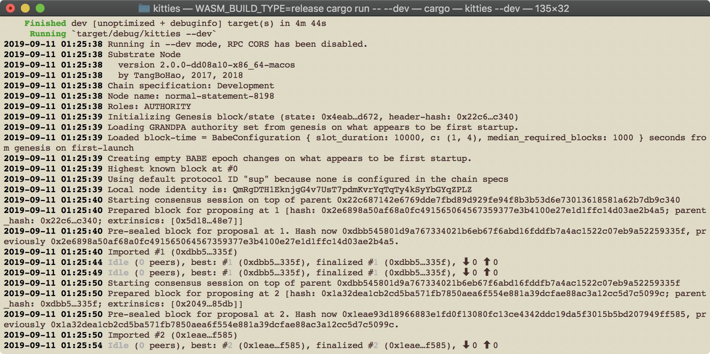
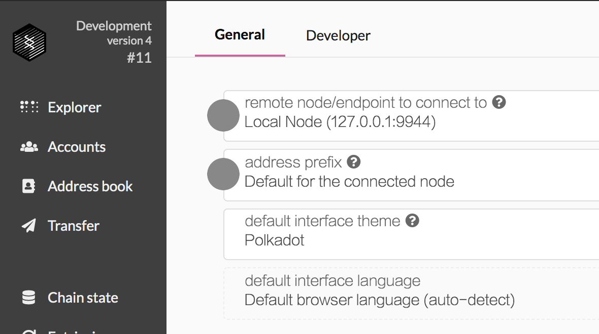
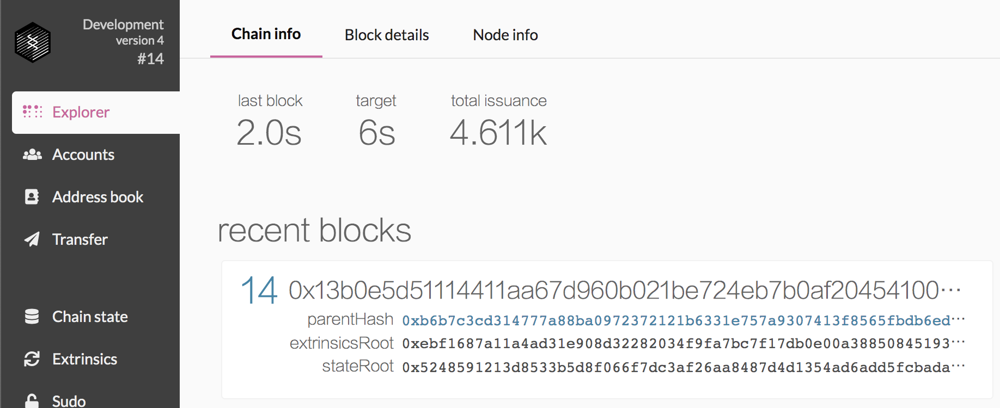
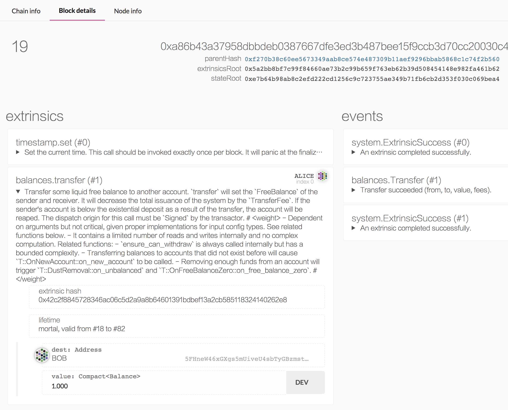

# 作业

## 题目要求

* 1.请在本目录完成第一课作业；
* 2.完成后，请及时提交作业；
* 3.提交作业过程：

  本人账号（guobin）/仓库（TeamX）-分支（master）→ 组织（SubstrateOrg）/团队（TeamX）-个人分支（01-guobin）

## 作业答案

### 工程目录

目录为: `projects/kitties`

本地作业最终结果commit为: `dd08a10f0e3275a0c9f282ed92070d09fd7774a9`

### 运行截图

* 启动日志

  

* 连接本地测试网

  
  

* 发起转账交易

  
